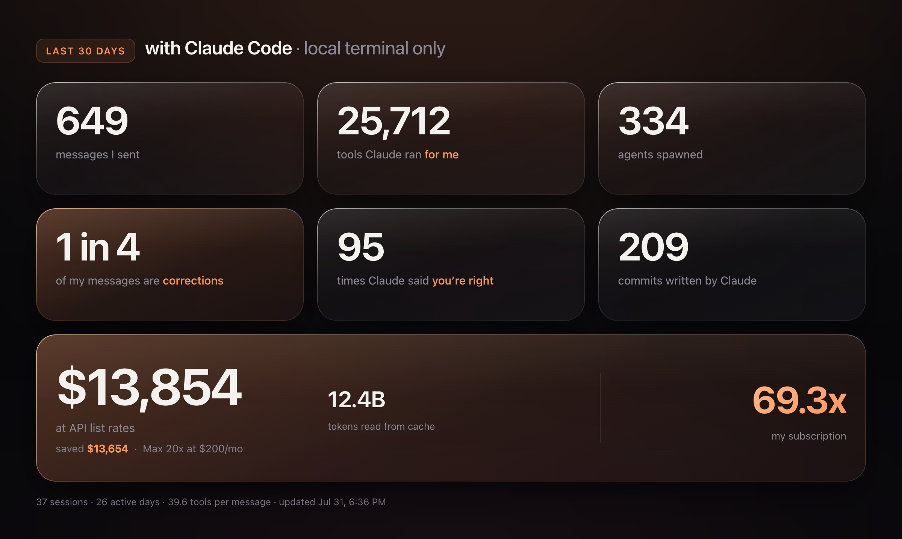
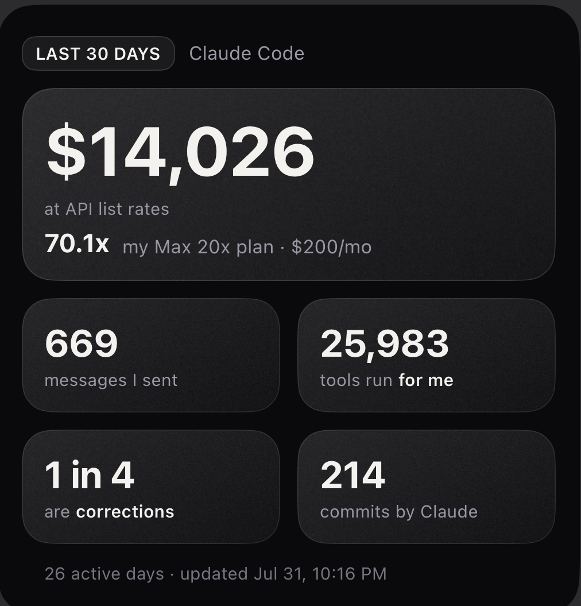

# claude-counter

A glanceable card of your last 30 days with Claude Code, on your Mac desktop and
your iPhone home screen. It reads the session transcripts already sitting on your
disk. No server, no hosting, no account, nothing to sign up for.





*Desktop above, iPhone widget below. Same data, two compositions - the phone one
is drawn natively rather than shown as an image, so the type stays pixel-exact.*

---

## Credit

The idea is not mine. I saw a "July with Claude Code" card on Threads — posted by
**@itsvlady**, watermarked **@danc_danc** — and wanted one that kept itself up to
date instead of being made by hand.

This is a rewrite rather than a copy. It keeps their structure (dark tile grid, big
numeral over a small label, one accent colour on the word that carries the joke)
and changes almost everything else: a rolling window instead of a calendar month,
different stats, glass tiles, an automated pipeline, and a second composition drawn
natively on the phone. If you like this, the original idea was theirs.

## What it shows

Everything on the card is computed from `~/.claude/projects/**/*.jsonl`, the
transcripts Claude Code already writes locally.

| | |
|---|---|
| Messages you typed | genuine human turns only |
| Tool calls run for you | including work done by subagents |
| Agents spawned | `Agent` tool invocations |
| Correction rate | how often you push back, as `1 in N` |
| "You're right" | how often Claude conceded |
| Commits | `git commit` run on your behalf |
| API-equivalent spend | what those tokens would cost at list price, and what that is as a multiple of your subscription |

The phrase counters are config, not code, so the last three tiles are yours to
change without touching Python.

## Requirements

- macOS, Claude Code, Python 3 with `pyyaml` (and `pillow` for render checks)
- [Übersicht](https://tracesof.net/uebersicht/) for the desktop widget — `brew install --cask ubersicht`
- [Scriptable](https://scriptable.app/) for the iPhone widget (free, optional)

## Install

```sh
git clone https://github.com/aidenfyf/claude-counter.git
cd claude-counter
pip3 install pyyaml pillow
./install.sh
```

`install.sh` does a first run, schedules a refresh every 10 minutes via launchd,
and drops the widget into Übersicht. Re-running it is safe.

### Do this first, or you lose data you cannot get back

Claude Code deletes transcripts after **30 days** by default. Set this in
`~/.claude/settings.json` *before* you start:

```json
{ "cleanupPeriodDays": 90 }
```

90 days covers the rolling window, a previous-30-day comparison, and calendar
month-over-month, each with margin. It costs a few GB and **plateaus** — old days
are pruned as new ones arrive, so it does not grow forever. Whatever the pruner has
already taken is gone; `archive.py` freezes each completed month so its numbers
survive even after the raw transcripts are deleted.

### Phone

1. Install Scriptable and open it once, so iCloud creates its folder.
2. Copy `widgets/ClaudeCounter.js` into `iCloud Drive/Scriptable/`.
3. Home screen → add a **Large** Scriptable widget → choose `ClaudeCounter`.

The Mac mirrors `stats.json` into Scriptable's iCloud folder automatically.

The phone widget is **drawn natively, not shown as an image** - every numeral and
label is real text, so it renders at exact device resolution instead of being a
resampled screenshot. It is monochrome by default (`ACCENT = false` at the top of
the file if you want the colour back).

Its background texture is baked by `execution/textures.py` and embedded in the
script as base64, so the widget has no runtime file dependency. Re-run that script
only if you change the card's colours or dimensions.

## Customising

Every phrase counter is a row in `config/patterns.yml`:

```yaml
  - key: my_counter
    who: me            # me = your typed turns; claude = assistant output
    mode: turns        # turns = messages that matched; hits = total occurrences
    label: "what it says under the number"
    regex: '\b(pattern)\b'
```

Then reference `S.phrases.my_counter.count` (or `.one_in`) in `card/card.html`,
and run `./execution/refresh.sh`.

Model prices and subscription tiers live in `config/rates.yml` — update them when
pricing changes rather than editing a hardcoded number. The plan you are on is read
from disk, not hardcoded.

Other useful knobs: `COUNTER_WINDOW_DAYS=7 python3 execution/count.py` for a
different window.

### Using it with something other than Claude Code

The card, the renderer and both widgets are agnostic — they only consume
`out/stats.json`. To point this at another tool, replace the scanner in
`execution/count.py` and emit the same shape. If your tool writes JSONL
transcripts, the filtering logic in `scan()` is most of the work already; if it
writes something else, only `scan()` changes.

### Android

The Mac side is unchanged, but Scriptable is iOS-only. `out/stats.json` is a plain
file, so the usual routes are a KWGT/Tasker widget reading it out of a synced
folder, or a small home-screen widget app that renders JSON. Not written here —
happy to take a PR.

## How it works

```
~/.claude/projects/**/*.jsonl
        │
        ├── execution/count.py    scan the rolling window  ->  out/stats.json
        ├── execution/archive.py  freeze completed months  ->  archive/YYYY-MM.json
        └── execution/render.py   stats + card/*.html      ->  out/card*.png
                                        │
                    ┌───────────────────┴───────────────────┐
              Übersicht widget                       Scriptable widget
              (desktop, shows card.png)     (phone, draws stats.json natively;
                                             background baked by textures.py
                                             and embedded in the script)
```

`execution/refresh.sh` runs all three in order; launchd calls it every 10 minutes.

## Things that cost me a day

Written down because none of them are obvious and all of them are silent.

**A human turn is `origin.kind == "human"`.** Everything else that looks like a user
message is machine noise: tool results, `[Image: …]` stubs, slash-command
expansions, `<bash-stdout>`, context-continuation summaries, hook feedback. Of 341
plain-string user rows without an `origin` field, zero were human writing.

**Cost must include subagent sidechains.** Agents spend real tokens on your behalf.
Filtering them out under-reports by roughly a third.

**Sum tokens across the window, then apply rates once.** Costing each message and
adding up truncates tens of thousands of times and drifts a couple of percent.

**Use a rolling window, not a calendar month.** Transcripts are pruned on a rolling
basis, so a rolling card can never claim data the pruner already took — and it is
never near-empty on the 1st.

**Never show a delta against a window you cannot prove is complete.** Measured
against a partially-pruned previous month it reads `+2000%`, which is the pruner,
not growth. One bogus number discredits every real one beside it.

**A LaunchAgent cannot overwrite an iCloud-tracked file.** It can create new files
there, but not modify or delete one iCloud has marked `UF_TRACKED` — which it does
to everything it syncs. Copy-over, truncate, rename-over and unlink-then-write all
fail, so the first run into a fresh folder succeeds and every run after it fails.
An Übersicht child process is not subject to that guard, so the mirror lives in the
widget. No Full Disk Access grant is needed anywhere.

**iCloud tells you a file is there when its bytes are not.** With the Mac asleep,
the phone still lists `stats.json`, still returns true from `fileExists()`, and
still claims `isFileDownloaded()` — and then `readString()` hands back an empty
string, because what is on the device is a dataless placeholder. A widget
extension gets seconds of runtime, so the on-demand fetch does not reliably land
inside the render. The card cannot depend on iCloud at draw time: on every
successful read it writes its own copy into Scriptable's **local** container and
falls back to that, marking the footer `cached`. The numbers are then as fresh as
the last sync and never blank, which is the correct trade for a home screen.

**Übersicht serves widgets over `http://localhost:41416`,** so a `file://` image is
cross-origin and blocked silently — you get alt text and a border, which reads as a
broken layout rather than a blocked request. Reference assets relatively.

**Do not put a bitmap of TEXT in a phone widget.** iOS rescales it to the widget's
real point size, which varies by device, so every glyph edge lands between pixels
and it looks soft beside native labels. Draw text with `addText()`. This does not
apply to a soft background - a gradient resamples invisibly.

**`stack.backgroundImage` does not render inside a widget extension.** It paints a
blank white block over its own contents, while looking perfectly correct in the
in-app preview - so it looks finished right up until it ships. `ListWidget`'s own
`backgroundImage` works fine. Put the texture on the widget, draw tiles on top as
semi-transparent fills, and let the ramp show through them.

**SwiftUI gradients do not dither, so subtle ones band.** A ramp gentle enough to
read as lit glass spans ~26 of 256 levels; across a widget each level becomes a
visible stripe. More contrast makes the stripes brighter, less removes the
lighting - no value fixes it. Bake the ramp instead.

**Use ordered dithering, not random noise.** Noise is incompressible by
definition: a native-resolution background came to 647 KB. An 8x8 Bayer pattern is
periodic, so deflate matches it across the image - the same picture costs 35 KB.
That is what makes native resolution affordable, and native resolution is what
stops the grain looking stretched.

**Verify the render, do not assume it.** A JS error produces a completely empty card
that still screenshots at exactly the right dimensions. `render.py` checks the live
DOM for the expected tile count and asserts the chamfer rim is present in the
actual pixels.

## Licence

MIT — see [LICENSE](LICENSE). The original card that inspired this is not mine and
is not included here.
